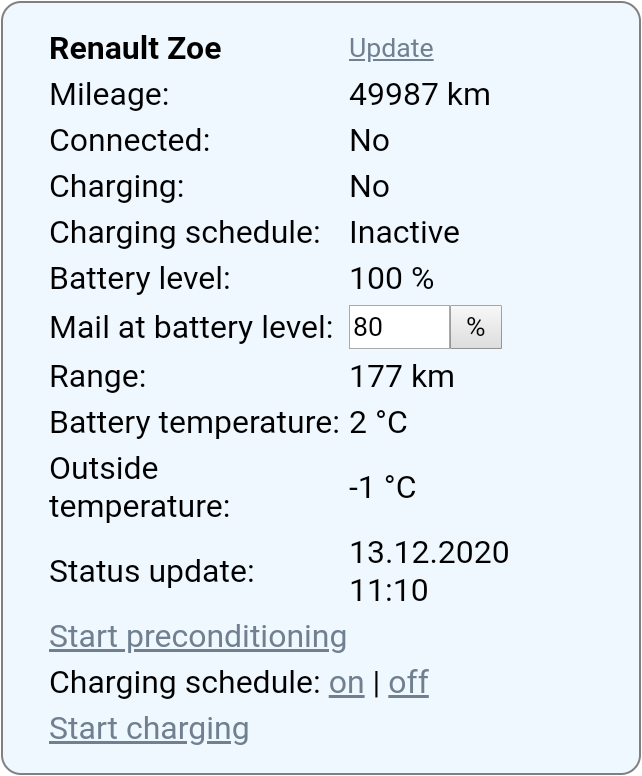

# ZoePHP
Unofficial PHP client for Renault Zoe.
Language for this repository is mostly German right now.
Translations will be added later.

## Voraussetzungen
* Webserver mit PHP 5.3 (oder neuer) und cURL
* Schreibrechte für das Skript im gleichen Ordner

## Benutzungshinweise
* Die config.php vor dem ersten Aufruf entsprechend anpassen.
* Während des ersten Aufrufs legt das Skript die Datei "session" an. In dieser Datei werden u.a. Account ID, Token sowie Fahrdaten zwischen gespeichert. Nach einem Update des Skripts diese Datei bitte löschen.
* Ist die Datenbank-Funktion aktiviert, wird die Datei database.csv angelegt, in der alle abgerufenen Daten gespeichert werden. Die Datei kann z.B. in Excel importiert werden. Zur regelmässigen Speicherung kann das Skript z.B. mit Cron aufgerufen werden.
* Konnten keine neuen Daten abgerufen werden, wird ein Hinweis zusammen mit den zuletzt abgerufenen Daten angezeigt.
* Man kann zwei einfache Mailbenachrichtigungen in Verbindung mit z.B. Cron einrichten: Ist beim Aufruf des Skriptes ein vorher eingestellter Akkustand während eines aktiven Ladevorgangs erreicht und/oder eine Benachrichtigung bei beendetem Ladevorgang erwünscht, wird eine Mail versendet.
* Wenn das Skript über "index.php?cron" bzw. "php index.php cron" aufgerufen wird, kann man konfigurieren in welchen Abständen die API abgefragt werden soll (während des Ladens, kein Ladevorgang), unabhängig davon wie oft das Skript selbst aufgerufen wird.
* Danke an @ToKen für die Wetter-API Integration für Ph2-Zoes! Wenn man diese Integration nutzen möchte, braucht man einen API-Schlüssel für openweathermap.org.
* Vielen Dank auch an [Muscat's OxBlog](https://muscatoxblog.blogspot.com/2019/07/delving-into-renaults-new-api.html) für das Entschlüsseln der API.
* Zur Sicherheit empfehle ich die Absicherung mit einem Verzeichnis-Passwort oder ähnlichen Zugriffsbeschränkungen.

## Screenshots
Ph1 | Ph2
------------ | -------------
 | 
